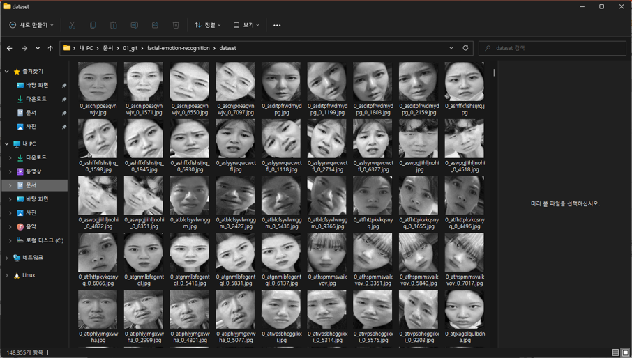
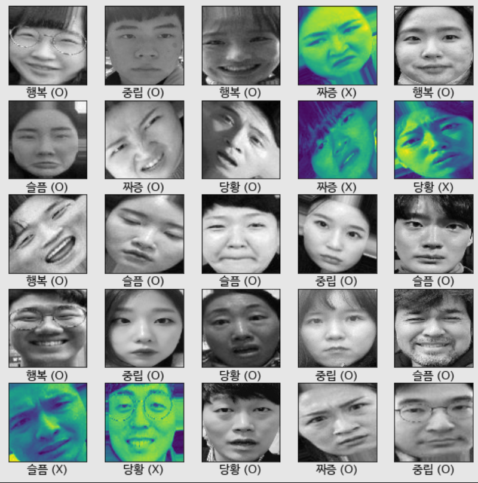
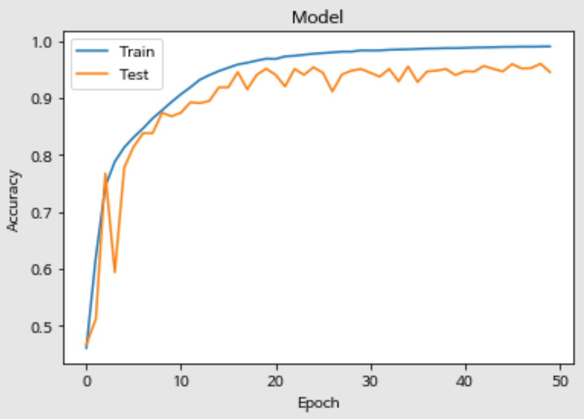
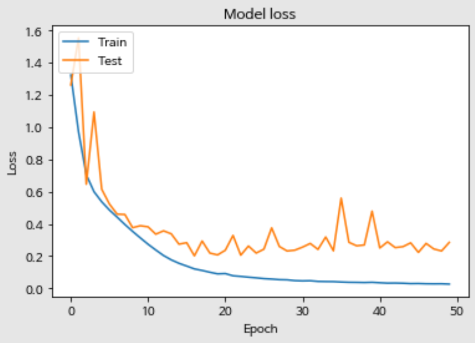

# 커스텀 ResNet50 모델로 만든 한국인 표정 인식기

- Author : **Song Kitae** (Department of AI Software, Dankook Software High School)
- Use Module : **`Tensorflow 2`**, **`Keras`**....
- Key Word : 딥러닝, ResNet50, Face Detect, Face-emotion-recognition

# 요약

1. ResNet50 모델을 일부 수정해서 순정 모델보다 성능을 21% 더 끌어올렸다.
2. 데이터셋으로는 [AI Hub](https://aihub.or.kr)에서 지원하는 [한국인 안면 이미지 데이터셋](https://aihub.or.kr/aidata/27716)을 사용했다.
3. 학습에 관여하지 않은 테스트 데이터셋으로 약 88%의 정확도를 얻어냈다.

# 시작하며...

ResNet을 공부하면서 'Facial-Expression-Recognition을 구현해보고 싶다.'고 느껴, 직접 모델링을 진행해봤습니다.

README에 자세히 적지 못한 내용이 있습니다. 예를 들어 모델을 어떻게 커스터마이징을 했는지 등등..
디테일한 부분들은 제가 제작한 [PDF 슬라이드](./slide.pdf)를 참조해주세요. 감사합니다.

전체 소스 코드는 [여기](./facial-expression-recognition.ipynb)를 누르시면 확인할 수 있습니다.

# 데이터셋

데이터셋으로는 [AI Hub](https://aihub.or.kr)에서 지원하는 [한국인 안면 이미지 데이터셋](https://aihub.or.kr/aidata/27716)을 사용했습니다.

Face Crop을 위해 [cvlib](https://github.com/arunponnusamy/cvlib)의 `detect_face`를 사용했습니다. 이후 표정을 구분하는데 Color는 크게 필요치 않다고 생각이 들어, 96x96로 Resize한 이미지 데이터를 Grayscale로 만들어주었습니다.

이에 그치지않고, Keras에서 제공하는 `ImageDataGenerator`를 이용하여 Image Augmentation을 진행했습니다. 사용한 하이퍼 파라미터는 아래와 같습니다.

```python
from keras.preprocessing.image import ImageDataGenerator

def random_noise(x):
  x = x + np.random.normal(size=x.shape) * np.random.uniform(1, 5)
  x = x - x.min()
  x = x / x.max()
           
  return x * 255.0

datagen = ImageDataGenerator(
  rotation_range=40,
  width_shift_range=0.07,
  height_shift_range=0.07,
  shear_range=0.2,
  zoom_range=0.2,
  horizontal_flip=True,
  fill_mode='nearest’,
  preprocessing_function=random_noise
)
```

데이터셋을 핸들링하는 코드가 궁금하시다면 [여기](./utils.py)를 눌러주세요.

## 생성된 이미지 데이터셋 결과

<center>



</center>

`./dataset/dataset.zip` 파일에 148,355장의 이미지 데이터(96\*96)가 압축되어 들어있으며, 직접 [다운로드](https://github.com/kitae0522/Facial-Expression-Recognition/raw/master/dataset/dataset.zip)하실 수 있고, wget를 이용해서 다운로드 하실 수 있습니다.

```shell
$ wget -O dataset.zip https://github.com/kitae0522/Facial-Expression-Recognition/raw/master/dataset/dataset.zip
```

# 학습 결과

`train` 데이터셋에서 약 99%의 accuracy를, 0.03의 loss, `valid` 데이터셋에서 약 95%의 accuracy를, 0.2의 loss를 가지며 학습을 완료했고, 학습에 관여하지 않은 `test` 데이터셋에서 약 88%의 accuracy를, 0.6의 loss를 기록했습니다.

<center>



</center>

|  |  |
| ---------------------------------------------- | ----------------------------------------------- |
| Model accuracy                                 | Model loss                                      |

# Give me feedback!

- E-Mail : kitae040522@gmail.com

컴퓨터 비전을 공부하고 있는 고등학생입니다. 위 이메일이나 이슈로 피드백을 남겨주시면 감사하겠습니다.
